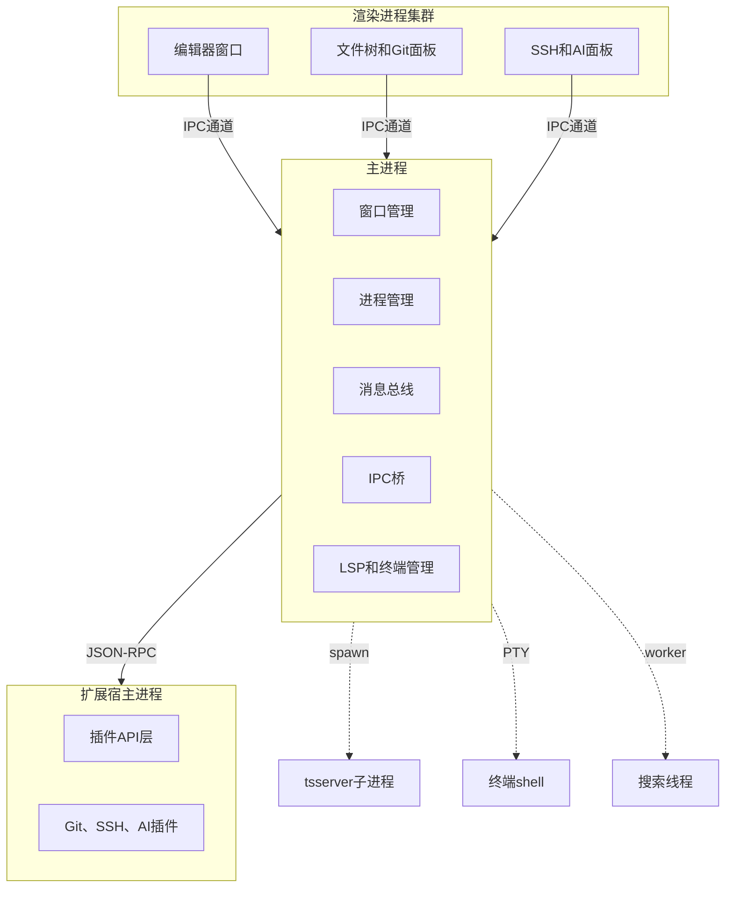
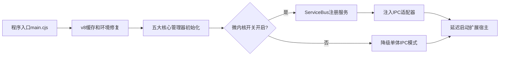
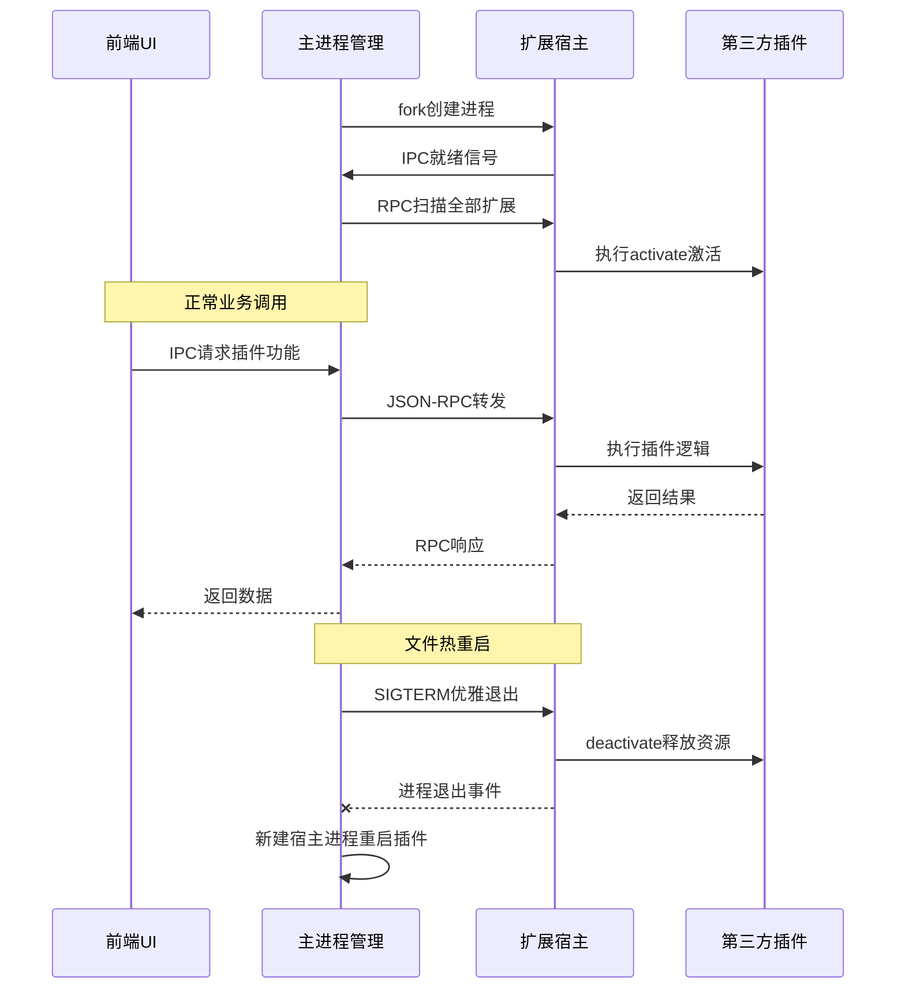
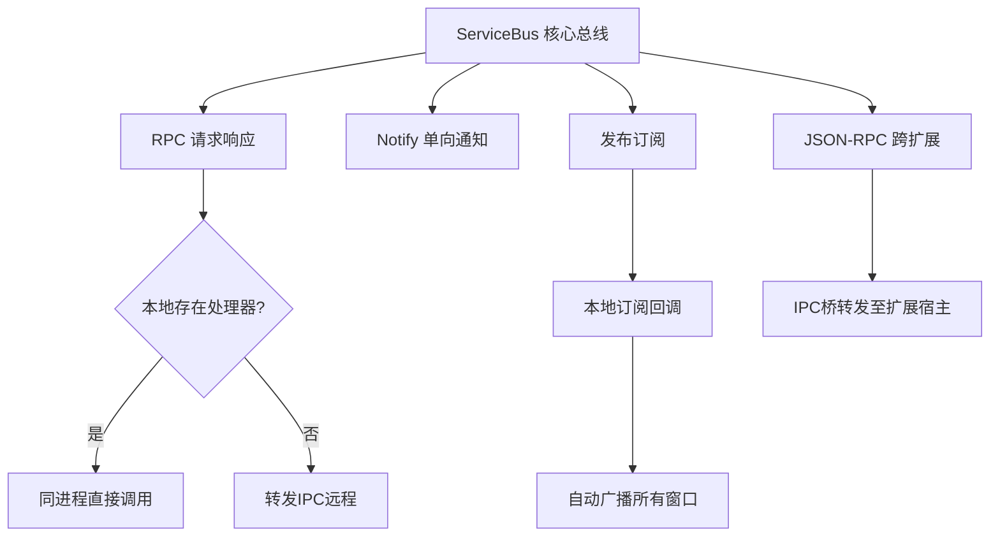
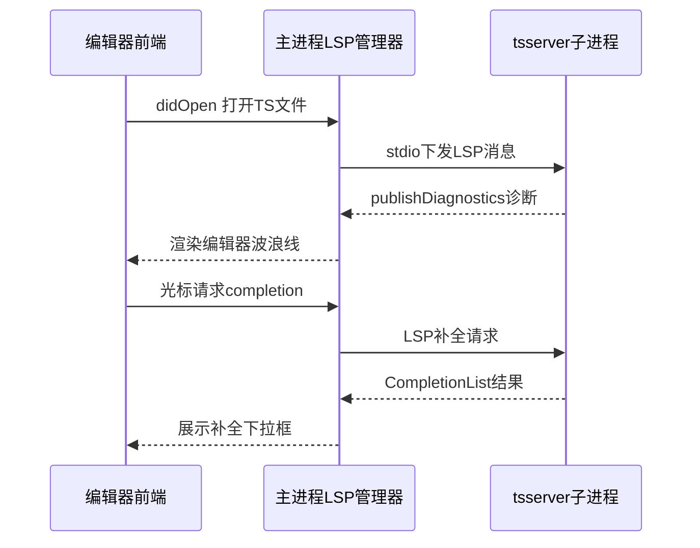
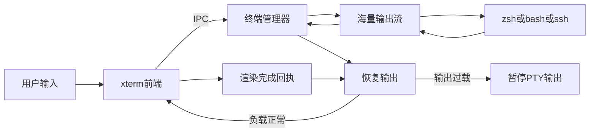
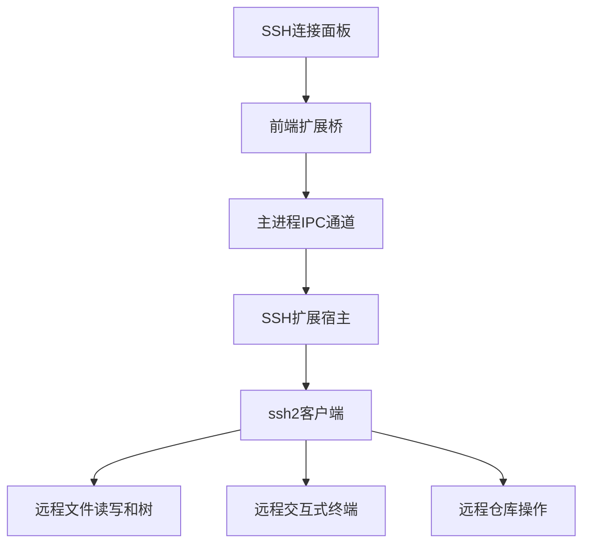
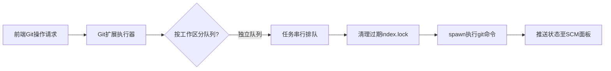

# IDEACODE

基于 **React + TypeScript + Vite + Monaco Editor + Electron** 构建的轻量级桌面 IDE。


> **三层进程隔离**：渲染进程（React UI） ↔ 主进程（系统资源管理） ↔ 扩展宿主（Git/SSH/AI 插件），通过 IPC + JSON-RPC 通信，崩溃隔离互不影响。

---

## 功能特性

IDEACODE 在标准 IDE 核心能力之上，构建了进程隔离的扩展系统，并通过三大内置扩展
（Git / SSH / LifeAiCode）覆盖版本控制、远程开发、AI 辅助三大场景。

### 🧰 IDE 核心功能

| 模块 | 能力 |
|------|------|
| 📁 **文件管理** | 完整文件树，支持创建/重命名/删除/拖拽/剪切板操作，自动定位当前文件 |
| ✏️ **代码编辑** | Monaco Editor 核心，50+ 语言高亮、TS 语义着色、Cmd+Click 跳转定义、Hover 提示 |
| 🔤 **TS Language Service** | 本地文件走外部 tsserver LSP（typescript-language-server），SSH 远程文件用自建 tsSdk Worker（Web Worker 内运行 `ts.LanguageService`），统一支持补全、跳转、诊断、语义高亮 |
| 📑 **分屏编辑** | 多编辑器组并排，标签页拖拽排序，标签历史导航， pinned 标签 |
| 🔍 **全局搜索** | 正则/整词/大小写/模糊全文搜索，按文件分组可折叠结果，FM-Index 加速 |
| ⚡ **Quick Open** | Cmd+P 文件模糊匹配，符号跳转（Cmd+Shift+O） |
| 🖥️ **内置终端** | xterm.js + node-pty，多 shell fallback、WebGL 渲染、PID 流控背压、SSH 终端 |
| 🌿 **Git 集成** | 见下方 Git 扩展（基于扩展系统实现） |
| 🔗 **SSH 远程** | 见下方 SSH 扩展（基于扩展系统实现） |
| 🤖 **AI 辅助** | 见下方 LifeAiCode 扩展（基于扩展系统实现） |
| 🧩 **扩展管理** | ExtensionsPanel 可查看/启用/禁用/卸载已安装扩展 |
| ⚙️ **设置面板** | 主题、字体、编辑器参数、扩展配置统一管理 |
| 📊 **状态栏** | Git 分支、语言、行列号、CPU/内存/GPU 实时监控 |
| 🎨 **主题** | 浅色/深色/高对比度，字体大小可调，VS Code 主题风格 |
| 🌍 **i18n** | 中/英多语言支持（i18next） |
| 📦 **多窗口** | 多窗口独立 Chromium 进程，某窗口卡死不影响其他 |
| 🔌 **Clone/Connect** | 内置 CloneRepoModal 克隆仓库、ConnectToModal 连接 SSH |

### 🌿 Git 扩展（`web/git/`）

参考 VS Code `vscode.git` 架构设计的内置源码管理扩展，运行在独立 Extension Host 子进程中。

**核心能力：**
- 📥 **完整 Git 操作**：stage / unstage / commit / discard / push / pull / branch switch
- 🌳 **多仓库管理**：每个工作区一个 `Repository` 实例，独立状态、独立刷新
- 📊 **porcelain v2 解析**：精确区分 staged / changes / merge / untracked 四类状态
- 🔍 **Diff 对比**：DiffEditorPanel 双栏差异展示，支持暂存区与工作区对比
- 🔄 **自动刷新**：fs.watch 监听工作区与 `.git` 目录 + fs.watchFile 兜底轮询 `.git/index`（macOS rename 不可靠），操作后立即刷新 + 5s 快速轮询窗口
- 🌐 **SSH 远程仓库联动**：与 SSH 扩展打通，断开连接时自动 dispose 远程仓库
- 🛡️ **并发安全**：命令按仓库序列化（Promise 队列），写操作前清理 30s+ 残留 `.git/index.lock`

**架构：** iframe WebView (React UI) ↔ JSON-RPC（经主进程转发）↔ Extension Host (Node.js + `git` CLI) ↔ postMessage 推送状态

### 🔗 SSH 扩展（`web/ssh/`）

基于 `ssh2` 库的 SSH/SFTP 远程开发扩展，支持在 IDE 内直接管理远程主机与文件。

**核心能力：**
- 🔐 **多会话管理**：Map 维护多个 SSH 连接，独立生命周期、独立日志
- 🗝️ **多认证方式**：私钥 / 密码 / `~/.ssh/id_rsa|id_ed25519|id_ecdsa` 默认私钥 / keyboard-interactive
- 📡 **远程命令执行**：`ssh.internal.execute` / `ssh.executeRemote`（非 PTY 模式，避免 stdout 污染）
- 📂 **SFTP 文件树**：远程目录浏览、读写、上传/下载
- 💻 **SSH 终端**：在 IDE 终端中直接打开远程 shell（xterm.js + SSH 通道）
- 💓 **连接保活**：`keepaliveInterval: 30s` + `keepaliveCountMax: 3`，避免长连接断开
- 🪟 **弹窗会话**：支持独立弹窗管理特定 SSH 会话
- 🤝 **跨扩展联动**：连接断开自动通知 Git 扩展清理、LifeAiCode 切换 remoteFsAdapter

**架构：** iframe WebView (React UI) ↔ JSON-RPC（经主进程转发）↔ Extension Host (Node.js + ssh2 Client) ↔ postMessage 推送状态

### 🤖 LifeAiCode 扩展（`web/lifeAiCode/`）

AI 代码辅助扩展，支持多 LLM Provider 与 Agent 自主编排，默认只读、用户确认后才落地变更。

**核心能力：**
- 🧠 **多 LLM Provider**：OpenAI / Anthropic / Ollama，可配置多份 API Key 与模型切换
- 💬 **对话式交互**：ChatPanel + Markdown 渲染 + 代码块语法高亮（react-syntax-highlighter）
- 🛡️ **只读模式（默认）**：AI 只分析代码、提供建议，绝不直接修改文件
- ✏️ **编辑模式**：用户切换后允许 Agent 应用编辑，所有变更经 Diff 预览确认
- 🤖 **Agent 模式**：内置 11 个工具自主编排任务
  - `read_file` / `read_file_lines` / `read_file_chunks` / `read_file_outline`
  - `get_file_tree` / `search_files` / `search_in_file`
  - `apply_edit` / `write_file` / `delete_file`
  - `execute_shell`
- 📋 **Plan Checklist**：Agent 任务拆解为可勾选步骤，逐步执行、可中断
- 🧮 **Token Budget**：上下文窗口预算管理，超长自动分块
- 📜 **审计日志**：`auditLogger` 记录所有 LLM 调用与工具执行，可回溯
- 🌐 **SSH 远程支持**：`remoteFsAdapter` 让 Agent 工具透明操作 SSH 远程文件
- 💡 **代码上下文**：`CodeContextBuilder` 自动收集当前文件/符号/相关引用作为上下文
- 📚 **历史记录**：会话持久化、新建/切换/继续历史会话

**架构：** iframe WebView (React UI + remark/rehype Markdown) ↔ JSON-RPC（经主进程转发）↔ Extension Host (LlmClient + AgentRuntime + SuggestionGenerator) ↔ postMessage 推送状态

---

## 整体布局

```
┌─────────────────────────────────────────────────┐
│  TopBar（标题栏 / 搜索 / 设置 / 面板切换）        │
├──────┬──────────┬───────────────┬───────────────┤
│Activ-│SidePanel │  主编辑区域     │  RightPanel   │
│ityBar│（文件树/  │（TabBar +     │  （AI 对话/   │
│      │  搜索/   │  MonacoEditor)│   扩展面板）   │
│      │  Git等） ├───────────────┤               │
│      │         │  BottomPanel  │               │
│      │         │  （终端/问题）  │               │
├──────┴──────────┴───────────────┴───────────────┤
│  StatusBar（Git分支/语言/行列号/CPU/内存/GPU）    │
└─────────────────────────────────────────────────┘
```

---

## 技术栈

| 技术 | 说明 |
|------|------|
| React 18 | UI 框架 |
| TypeScript | 类型安全 |
| Vite 5 | 构建工具与热更新 |
| Monaco Editor | VS Code 同款编辑器核心 |
| Electron 30 | 跨平台桌面应用框架 |
| Redux Toolkit | 状态管理 |
| xterm.js + node-pty | 内置终端 + 伪终端 |
| i18next | 国际化 |

---

## 架构流程图

### 1. 三层进程隔离整体架构



> 三层隔离实现安全、故障、资源隔离；主进程拥有系统唯一操作权限，渲染/扩展进程无法直接访问底层系统 API。

### 2. 微内核双轨启动流程



> 采用灰度开关+自动降级，微内核启动失败不会导致程序崩溃，兼容新旧两套架构。

### 3. 扩展宿主生命周期时序



> 两段式销毁：SIGTERM 优先优雅卸载，2 秒无响应则 SIGKILL 强制杀死；双标记区分热重启/永久关闭。

### 4. ServiceBus 消息总线四种通信模式



> 本地优先策略减少 IPC 开销；发布订阅自动同步所有渲染窗口，上层无需关心进程分布。

### 5. tsserver LSP 语言服务流程



> 本地文件走外部 tsserver LSP；SSH 远程文件自动切换自建 tsSdk Worker，绕过 tsserver 的 file URI 限制。

### 6. node-pty 终端数据流与背压控制



> 高低水位背压机制防止 IPC 队列爆满、页面卡死。

### 7. SSH 远程开发调用链路



### 8. Git 命令串行防锁执行流程



> 同一仓库命令串行执行，杜绝并发产生 `.git/index.lock` 锁文件冲突。

## 环境要求

- **Node.js** >= 18.12.0
- **npm** >= 9.0
- **操作系统**：macOS / Windows / Linux（需图形界面）

---

## 快速开始

```bash
# 安装依赖
npm install

# 浏览器 Web 版（热更新）
npm run dev

# 桌面开发模式（推荐，Electron 热更新 + DevTools）
npm run electron:dev

# 桌面生产预览
npm run electron:preview
```

> 国内网络安装 Electron 慢时，可使用镜像：
> ```bash
> ELECTRON_MIRROR=https://npmmirror.com/mirrors/electron/ npm install
> ```

---

## 扩展系统

IDEACODE 采用插件式架构，扩展在独立的 Extension Host 子进程中运行，通过 JSON-RPC 与渲染进程通信。

| 扩展 | 目录 | 说明 |
|------|------|------|
| **Git** | `web/git/` | Git 版本控制面板 |
| **SSH** | `web/ssh/` | SSH/SFTP 远程文件管理 |
| **LifeAiCode** | `web/lifeAiCode/` | AI 代码辅助（多 LLM + Agent） |

```bash
# 方式一：在项目根目录使用快捷命令（推荐）
npm run build:git-extension    # 构建 Git 扩展
npm run build:ssh-extension    # 构建 SSH 扩展

# 方式二：手动进入各扩展目录构建
cd web/lifeAiCode && npm run build:all
cd web/git && npm install && npm run build
cd web/ssh && npm install && npm run build
```

---

## 常用命令

| 命令 | 说明 |
|------|------|
| `npm run dev` | Web 开发服务器 |
| `npm run build` | 生产构建 |
| `npm run preview` | 浏览器预览生产构建 |
| `npm run lint` | ESLint 检查 |
| `npm run electron:dev` | **桌面开发模式**（推荐） |
| `npm run electron:preview` | 桌面生产预览 |

---

## 项目结构

```
ideacode/
├── electron/                     # Electron 主进程
│   ├── main.cjs                  # 窗口管理、菜单
│   ├── preload.cjs               # 安全 IPC 桥接
│   └── extension-host/           # Extension Host RPC
├── src/                          # 渲染进程（IDE 主体）
│   ├── components/               # UI 组件（ActivityBar/Monaco/TabBar/…）
│   ├── store/slices/             # Redux 状态切片
│   ├── plugin/                   # 插件系统 + 扩展桥接
│   ├── services/                 # 文件/终端/Git 服务层
│   ├── utils/algorithms/         # 高级算法（BCM/PageRank/Bandit/FM-Index/…）
│   └── i18n/                     # 国际化
├── web/                          # 扩展前端源码
│   ├── git/
│   ├── ssh/
│   └── lifeAiCode/
├── extensions/                   # 扩展构建产物（gitignored）
├── package.json
└── vite.config.ts
```

---

## 已知问题

1. **Monaco Editor 首次加载**：核心资源较大，首次打开文件可能有短暂等待（已做预加载优化）
2. **File System Access API 兼容性**：Safari 不支持，建议使用 Electron 桌面端
3. **无头服务器限制**：Electron 需要图形界面环境

---

## 版权声明 / License

本项目代码仅供个人学习、研究或非商业用途使用。

- ✅ 允许：查看源码、个人学习研究、非商业性质的交流
- ❌ 禁止：未经书面授权，严禁将本项目用于任何商业用途（包括但不限于作为商业产品的一部分、出售、出租、或用于企业内部盈利性项目）
- 如需商业授权或合作，请联系：📧 [chongyin_good@163.com](mailto:chongyin_good@163.com) | [mimicy710@gmail.com](mailto:mimicy710@gmail.com)

> ⚠️ Legal Notice: All Rights Reserved. Unauthorized commercial use is strictly prohibited and will be subject to legal action.